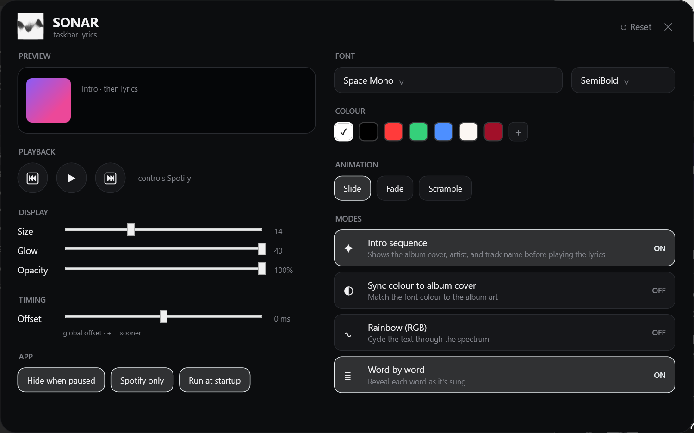

# 🎵 Sonar — taskbar lyrics

Sonar shows your currently‑playing **Spotify** song's lyrics in the empty space of your
Windows taskbar — glowing text revealed **word‑by‑word**, right at home over a centered,
translucent ([TranslucentTB](https://github.com/TranslucentTB/TranslucentTB)) taskbar.
Each track opens with an **album art · artist · track** card that scrambles into the lyrics.

No login, no API key, no admin — it reads what's playing from Windows itself.



## ⬇️ Download

### **[→ Download the latest `Sonar.exe`](https://github.com/EchoVial/Sonar/releases/latest)**

1. Grab `Sonar.exe` from the latest release.
2. Double‑click it. No installer, no admin, nothing to install — it's a self‑contained build.
3. Sonar lives in your **system tray** (the waveform icon). Play a song in Spotify and the
   lyrics appear on your taskbar.

> Designed for a **centered**, **translucent** taskbar (Windows 11 + TranslucentTB). Sonar
> draws in the empty area to the *left* of your centered icons and auto‑fits the space.

## ✨ Features

- **Word‑by‑word reveal** timed to the song — true per‑word timing when the source has it.
- **Intro sequence** — album art + artist + track, scrambling into the first line.
- **Make it yours** — fonts, a colour picker (wheel + brightness + hex + RGB), glow, opacity,
  and animation styles (slide / fade / scramble).
- **Colour modes** — a fixed colour, **sync to the album cover**, or a **rainbow** cycle.
- **Controls Spotify** — previous / play‑pause / next from the settings window.
- **Lightweight & private** — event‑driven, idle RAM ≈ 15 MB; reads now‑playing from Windows'
  media API (SMTC), never your Spotify account.
- **Smart visibility** — hides when a fullscreen app covers the taskbar, returns on **Win**.
- **Long lines wrap** to a second row instead of running under your icons.
- **Starts with Windows** (toggle in settings).

## ⚙️ Settings

**Left‑click the tray icon** to open settings — everything applies live:

- **Font & weight**, **Size / Glow / Opacity** sliders
- **Colour** — quick swatches (white · black · red · green · blue), **add your own**
  (wheel + brightness + hex + RGB), and remove customs
- **Animation** — slide / fade / scramble
- **Modes** — intro sequence · sync colour to album cover · rainbow · word‑by‑word
- **Offset** — nudge a song's timing (remembered per song; − later / + sooner)
- **App** — hide when paused · Spotify‑only · run at startup

Right‑click the tray icon for a quick menu. Settings persist to `%APPDATA%\Sonar\config.json`.

## 🔍 How it works

1. **Now playing + position** come from `GlobalSystemMediaTransportControls` (SMTC),
   interpolated between updates for smooth timing — no Spotify login.
2. **Lyrics** are fetched once per track and cached, trying sources concurrently and
   preferring timed ones:
   **LRCLIB** (synced) → **NetEase** (synced, incl. word‑level "yrc") →
   **Genius** (plain text, covers obscure tracks) → a now‑playing card if nothing's found.
3. **Timed** lyrics sync to real LRC timestamps. **Untimed** (Genius/plain) lyrics are
   spread across the track weighted by line length — a best‑effort estimate; the **Offset**
   slider fine‑tunes any song.

## 🛠️ Build from source

Requires the **.NET 8 SDK** (Windows).

```powershell
# dev build
dotnet build -c Debug

# framework‑dependent (small; needs the .NET 8 Desktop Runtime installed)
dotnet publish -c Release -o publish-fd

# portable, self‑contained single file (no runtime needed — this is what ships in Releases)
dotnet publish -c Release -r win-x64 --self-contained true `
  -p:PublishSingleFile=true -p:IncludeNativeLibrariesForSelfExtract=true `
  -p:EnableCompressionInSingleFile=false -p:DebugType=none -o dist
```

WPF on .NET 8 (`net8.0-windows`). Layout:

| Folder | What's in it |
|--------|--------------|
| `Media/` | SMTC watcher + position interpolation |
| `Lyrics/` | source orchestration, providers (LRCLIB / NetEase / Genius), LRC parser, scheduler |
| `Taskbar/` | placement, empty‑region detection, fullscreen/visibility |
| `Overlay/` | the transparent, click‑through glow window |
| `Settings/` | settings window, colour editor, live preview |
| `Tray/` · `Startup/` · `Config/` · `Interop/` · `Util/` · `Fonts/` | tray icon, autostart, config, Win32 interop, helpers, embedded fonts |

## 📝 Notes

- Lyrics come from community databases, so wording can differ from Spotify's in‑app
  (Musixmatch) lyrics, and a rare obscure track may have none anywhere.
- Untimed lyrics can't be perfectly synced — there's no timing data to sync *to* — so the
  per‑song offset handles the rest.
- Not affiliated with Spotify. For personal use.

## 📄 License

[MIT](LICENSE).
